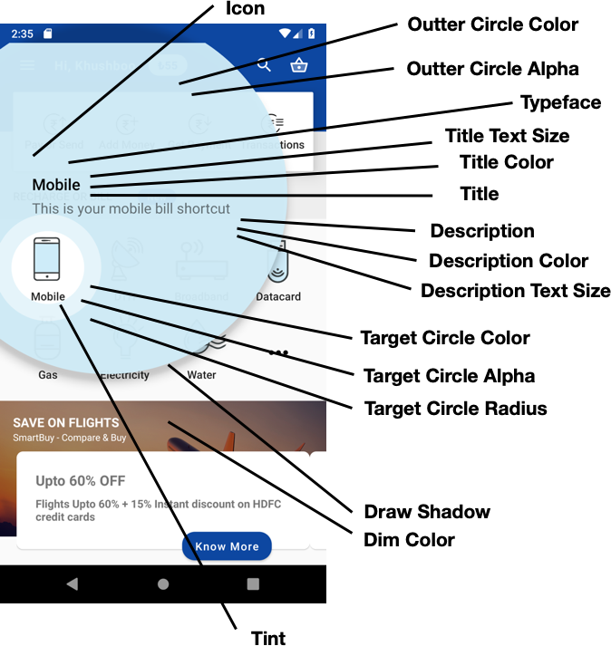

1.  [OneFrameMobile](index.html)
2.  [Components](Components_9601453.html)
3.  [Showcase](Showcase_42402321.html)

# OneFrameMobile : Showcase - Android

Created by Unknown User (09370188), last modified on 12 Jun, 2019

*   [Introduction](#introduction)
*   [Getting Started](#getting-started)
*   [Single](#single)
*   [Sequence](#sequence)

# Introduction

Showcase library spots a given view. It can be used to highlight new features.

You can download [sample app](http://bellatrix:8080/tfs/ArgeMimariCollection/OneFrameAndroid/_git/Showcase).

# Getting Started

Following lines need to be added in related files. Make sure to sync project after modification.

**build.gradle (Project)**

<pre class="syntaxhighlighter-pre" data-syntaxhighlighter-params="brush: groovy; gutter: false; theme: Eclipse" data-theme="Eclipse">allprojects {
    repositories {
        maven { url "http://195.87.213.161:8081/artifactory/libs-release-local" }
    }
}</pre>

**build.gradle (app)**

<pre class="syntaxhighlighter-pre" data-syntaxhighlighter-params="brush: groovy; gutter: false; theme: Eclipse" data-theme="Eclipse">dependencies {
    implementation 'com.oneframe.android:showcase:1.2.0'
}</pre>

# Single

Highlights a single view.

<pre class="syntaxhighlighter-pre" data-syntaxhighlighter-params="brush: java; gutter: false; theme: Eclipse" data-theme="Eclipse">Showcase target = ShowcaseTarget
					.forView(mSearch, "Search", "You can search bills from here")
    				.outerCircleColor(R.color.colorAccent)
					.outerCircleAlpha(0.5f)
					.typeface(Typeface.BOLD)
					.titleTextSize(24)
					.titleTextColorInt(Color.BLACK)
					.title("Selam")
					.descriptionTextSize(24)
					.descriptionTextColorInt(Color.BLACK)
					.description("Nasilsin?")
   					.textColor(android.R.color.black)
					.targetCircleColorInt(Color.BLUE)
					.targetCircleAlpha(0.8f)
					.targetCircleRadius(60)
					.dimColor(R.color.white)
					.tint(false)
   					.drawShadow(true)
					.icon(drawable)

ShowcaseTargetView.showFor(
    context,
    target,
    "Dashboard",
    new ShowcaseTargetView.Listener() {
      	@Override
      public void onTargetClick(ShowcaseTargetView view) {
        super.onTargetClick(view);
      }

      @Override
      public void onTargetLongClick(ShowcaseTargetView view) {
        super.onTargetLongClick(view);
      }

      @Override
      public void onTargetCancel(ShowcaseTargetView view) {
        super.onTargetCancel(view);
      }

      @Override
      public void onOuterCircleClick(ShowcaseTargetView view) {
        super.onOuterCircleClick(view);
      }

      @Override
      public void onTargetDismissed(ShowcaseTargetView view, boolean userInitiated) {
        super.onTargetDismissed(view, userInitiated);
      }
    });</pre>

<table class="relative-table wrapped confluenceTable" style="width: 24.8874%;"><colgroup><col style="width: 73.6961%;"></colgroup>

<tbody>

<tr class="xtr-0">

<th class="xtd-0-0 confluenceTh">**TARGET**</th>

</tr>

<tr class="xtr-1">

<td class="xtd-1-0 confluenceTd">outerCircleColor(int colorRes)</td>

</tr>

<tr class="xtr-2">

<td class="xtd-2-0 confluenceTd">outerCircleAlpha(int alpha)</td>

</tr>

<tr class="xtr-3">

<td class="xtd-3-0 confluenceTd">targetCircleColor(int colorRes)</td>

</tr>

<tr class="xtr-4">

<td class="xtd-4-0 confluenceTd">titleTextSize(int size)</td>

</tr>

<tr class="xtr-5">

<td class="xtd-5-0 confluenceTd" colspan="1">titleTextColor(int colorRes)</td>

</tr>

<tr class="xtr-6">

<td class="xtd-6-0 confluenceTd" colspan="1">descriptionTextSize(int size)</td>

</tr>

<tr class="xtr-7">

<td class="xtd-7-0 confluenceTd" colspan="1">descriptionTextColor(int colorRes)</td>

</tr>

<tr class="xtr-8">

<td class="xtd-8-0 confluenceTd" colspan="1">textColor(int colorRes)</td>

</tr>

<tr class="xtr-9">

<td class="xtd-9-0 confluenceTd" colspan="1">typeface(Typeface typeface)</td>

</tr>

<tr class="xtr-10">

<td class="xtd-10-0 confluenceTd" colspan="1">dimColor(int colorRes)</td>

</tr>

<tr class="xtr-11">

<td class="xtd-11-0 confluenceTd" colspan="1">drawShadow(boolean shadow)</td>

</tr>

<tr class="xtr-12">

<td class="xtd-12-0 confluenceTd" colspan="1">transparentTarget(boolean transparent)</td>

</tr>

<tr class="xtr-13">

<td class="xtd-13-0 confluenceTd" colspan="1">icon(Drawable drawable)</td>

</tr>

<tr class="xtr-14">

<td class="xtd-14-0 confluenceTd" colspan="1">targetRadius(int radius)</td>

</tr>

</tbody>

</table>

<table class="relative-table wrapped confluenceTable" style="width: 18.0743%;"><colgroup><col style="width: 100.0%;"></colgroup>

<tbody>

<tr class="xtr-0">

<th class="xtd-0-0 confluenceTh">VIEW</th>

</tr>

<tr class="xtr-1">

<td class="xtd-1-0 confluenceTd" colspan="1">target(Target target)</td>

</tr>

<tr class="xtr-2">

<td class="xtd-2-0 confluenceTd" colspan="1">key(String key)</td>

</tr>

<tr class="xtr-3">

<td class="xtd-3-0 confluenceTd">listener(Listener listener)</td>

</tr>

</tbody>

</table>

# Sequence

Highlights given views as queue.

<pre class="syntaxhighlighter-pre" data-syntaxhighlighter-params="brush: java; gutter: false; theme: Eclipse" data-theme="Eclipse">Showcase first = ShowcaseTarget
					.forView(mSearch, "Search", "You can search bills from here")
					.title("Selam")
					.description("Nasilsin?");

Showcase second = ShowcaseTarget
					.forView(mKnowMore, "Search", "You can search bills from here")
					.title("Selam")
					.description("Nasilsin?");

new ShowcaseTargetSequence(this)
 .target(first)
 .target(second)
 .listener(
 new ShowcaseTargetSequence.Listener() {
 @Override
 public void onSequenceFinish() {}

 @Override
 public void onSequenceStep(ShowcaseTarget lastTarget, boolean targetClicked) {}

 @Override
 public void onSequenceCanceled(ShowcaseTarget lastTarget) {}
 })
 .start();</pre>

<table class="relative-table wrapped confluenceTable" style="width: 21.2275%;"><colgroup><col style="width: 100.0%;"></colgroup>

<tbody>

<tr class="xtr-0">

<th class="xtd-0-0 confluenceTh">**SEQUENCE**</th>

</tr>

<tr class="xtr-1">

<td class="xtd-1-0 confluenceTd">targets(Target... target)</td>

</tr>

<tr class="xtr-2">

<td class="xtd-2-0 confluenceTd" colspan="1">targets(List<Target> targets)</td>

</tr>

<tr class="xtr-3">

<td class="xtd-3-0 confluenceTd" colspan="1">target(Target target)</td>

</tr>

<tr class="xtr-4">

<td class="xtd-4-0 confluenceTd" colspan="1">continueOnCancel(boolean continue)</td>

</tr>

<tr class="xtr-5">

<td class="xtd-5-0 confluenceTd" colspan="1">startWith(int start)</td>

</tr>

<tr class="xtr-6">

<td class="xtd-6-0 confluenceTd" colspan="1">startAt(int at)</td>

</tr>

<tr class="xtr-7">

<td class="xtd-7-0 confluenceTd" colspan="1">key(String key)</td>

</tr>

<tr class="xtr-8">

<td class="xtd-8-0 confluenceTd" colspan="1">listener(Listener listener)</td>

</tr>

</tbody>

</table>

## Attachments:

 [Showcase.png](.documentation/43614608.png) (image/png)  
 [showcase_gif.gif](.documentation/43614612.gif) (image/gif)  

<section class="footer-body">

Document generated by Confluence on 26 Mar, 2021 11:14

[Atlassian](http://www.atlassian.com/)

</section>

